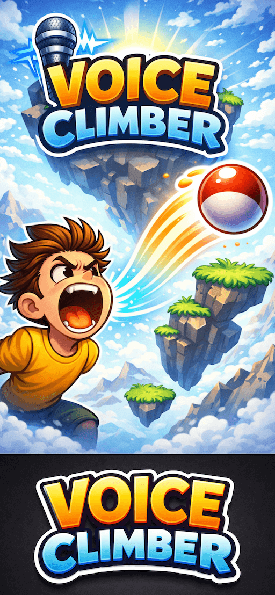
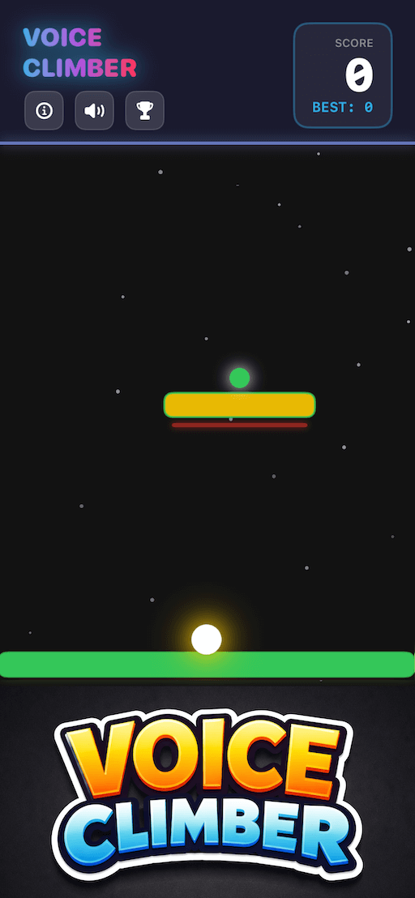
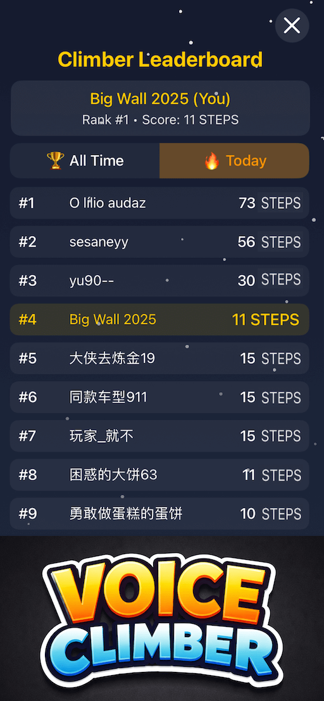

  

# 🎤 Voice Climber: Shout to Jump

**Voice Climber** is a chaotic arcade climbing game where **your voice and device motion** are the only controls.  
Shout to jump, tilt to move — stay quiet, and you fall.

👉 **Download on the App Store:**  
https://apps.apple.com/us/app/voice-climber/id6758340146

---

## 📸 Screenshots

  
  
  

---

## 🕹️ Gameplay

- 🎙️ **Your voice controls the jump**
- 🔊 Louder sound = higher jump
- 📱 Tilt your device to move left & right
- 🎯 Timing and control matter more than nonstop screaming

---

## 🎮 How to Play

1. Make sound to jump  
2. Tilt your device to control movement and landing  
3. Climb as high as possible without falling  

---

## ✨ Features

- Simple but unique controls: **Voice + Tilt**
- Fast, addictive arcade climbing
- Funny fails & intense moments
- 🌍 Global **Game Center Leaderboards**
- Great for challenges, parties, and streaming
- Easy to learn, hard to master

---

## 🏆 Compete Worldwide

- Compare your highest climb with friends
- Rank up on global leaderboards
- Prove who has the best **voice + control**

---

## ❤️ Why You'll Love It

- A truly **voice-controlled** arcade experience
- Every run feels different
- Perfect for quick, fun sessions
- Extremely fun to watch others play

---

**Made with chaos, screams, and gravity.** 🚀
